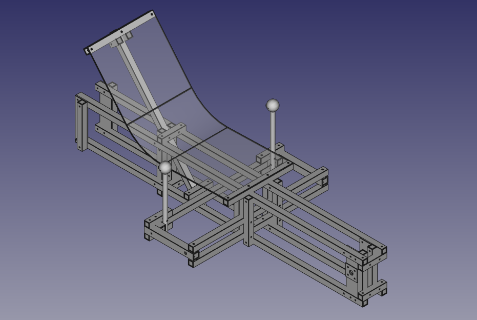

# XYZ ONESEATER Trike

The XYZ ONESEATER is a trike bicycle, which frame and steering components are mainly built out of 25mm square aluminum tubing.

## About

This Github repository provides the sources of this project in FreeCAD format (.FCStd) along with the resulting technical drawings summarized in the PDFs. See [OneSeater_TechDrawings.pdf](https://github.com/FreeCutter/XYZ_ONESEATER/blob/master/OneSeater_TechDrawings.pdf).

Clips of the vehicles in action can be found:  
* https://youtu.be/CPaBOMBIfKA
* https://youtu.be/3dgY7bEmk1Q

Furthermore there is a thread available on the German [velomobilforum.de](https://www.velomobilforum.de/forum/index.php?threads/eigenbau-xyz-spaceframe-vehicle.33109/).

### DISCLAIMER
Although every precaution has been taken in the preparation of these plans, copyright holders and contributors assume no responsibility for errors and omissions. Nor is any liability assumed for damages resulting from the information contained herein.

### Background

The original construction drawings for the XYZ ONESEATER may be downloaded from [N55.dk](http://www.n55.dk/MANUALS/SPACEFRAMEVEHICLES/spaceframevehicles.html). **Credits to [N55](http://www.n55.dk) and collaborator Till Wolfer**.

The intention of this repository was to get the original construction drawings ported over to [FreeCAD](https://www.freecadweb.org), an open-source parametric 3D modeler made primarily to design real-life objects of any size. Following the idea of open source formats it is obvious to use open source tools.

The process of porting the STL over to the FreeCAD file format followed the structure of the original construction plan. i.e. each single component was generated in FreeCAD (see [FreeCAD workflow](https://github.com/FreeCutter/XYZ_ONESEATER/blob/master/FreeCAD%20workflow%20and%20version.md)). Subsequently the needed components are used in assemblies like frame and steering bridge resulting in the final vehicle. The resulting FreeCAD files (`.FCStd`) generate technical drawings (via the TechDraw workbench). It's obvious that slight adjustments had been made compared to the original plan.

Thus, the both now available open source FreeCAD files as well as the resulting construction manual are the first fork of the original drawing. You could use them to start your own DIY project reproducing an XYZ ONESEATER. 

### Contribute
If you have done any further improvements or changes to the model, please contribute them accordingly in order to get further on the road of shared open source development.

For corrections/changes/additions please specifically submit a pull request (PR) to this Github repo issue queue: https://github.com/FreeCutter/XYZ_ONESEATER/issues

### Roadmap

A potential fork might be the XYZ TWOSEATER which already had been introduced as [THREESEATER](https://www.dropbox.com/s/jynk9lwfgj25o40/dreisitzer.avi). However, it seems to be that FreeCAD drawings are still missing and could be added/developed/provided accordingly.

### Credits

**Credits to [N55](http://www.n55.dk) and collaborator Till Wolfer**.

### License

Sharing alike as the original does the idea of this Github repository is to remix, transform, or build upon the original construction drawings provided. Thus, all of us have to distribute our contributions in this repository under the same [license](LICENSE.md) as the original: [CC BY-NC-SA 3.0](https://creativecommons.org/licenses/by-nc-sa/3.0/).

Have fun!
